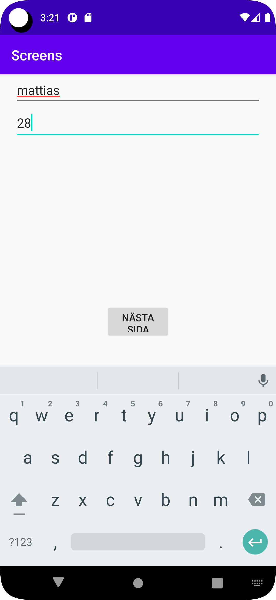

# Rapport


la seden till en knapp och kod för att koppla kanppen till att öppnna det nya förnstret

sedan jobbade jag fram den koden som syns nedan för att göra så att man kan skriva in sitt namn och sin ålder
och så att det sedan syns på aktivitet 2

Lagt till en second activity xml fil med tillhörande java class efter en del försk och tillslut en ny fork
```
public class SecondActivity extends AppCompatActivity {

    @Override
    protected void onCreate(Bundle savedInstanceState) {
        super.onCreate(savedInstanceState);
        setContentView(R.layout.activity_second);
    }
}

<?xml version="1.0" encoding="utf-8"?>
<androidx.constraintlayout.widget.ConstraintLayout xmlns:android="http://schemas.android.com/apk/res/android"
    xmlns:app="http://schemas.android.com/apk/res-auto"
    xmlns:tools="http://schemas.android.com/tools"
    android:layout_width="match_parent"
    android:layout_height="match_parent"
    tools:context=".SecondActivity">

</androidx.constraintlayout.widget.ConstraintLayout>
```
vidare la jag till en kanpp efter jag deklarerat den i min main activiety för att ha något som öppnar min second activety
sen satte jag på en on click litener på kanppen coh en metod till detta som uppfyllde funktionen att öppna andra skärmen
edan jobbade jag fram den koden som syns nedan för att göra så att man kan skriva in sitt namn och sin ålder
```

 button = (Button)  findViewById(R.id.button);
        button.setOnClickListener(new View.OnClickListener() {
            @Override
            public void onClick(View view) {
              String nameS = name.getText().toString();
                String ageS = age.getText().toString();

                Intent intent = new Intent(MainActivity.this, SecondActivity.class);

                intent.putExtra("Namn",nameS );
                intent.putExtra("Ålder",ageS );

                startActivity(intent);
        });
    }

 ```
det sista jag gjorde var att skriva kod för att de angivna namnet och åldern skulle synas på sida 2  
```
 
    
    name = findViewById(R.id.getname);
        age = findViewById(R.id.getage);

        Intent intent = getIntent();
        String nameS = intent.getStringExtra("Namn");
        String ageS = intent.getStringExtra("Ålder");

        name.setText(nameS);
        age.setText(ageS);
```





Läs gärna:

- Boulos, M.N.K., Warren, J., Gong, J. & Yue, P. (2010) Web GIS in practice VIII: HTML5 and the canvas element for interactive online mapping. International journal of health geographics 9, 14. Shin, Y. &
- Wunsche, B.C. (2013) A smartphone-based golf simulation exercise game for supporting arthritis patients. 2013 28th International Conference of Image and Vision Computing New Zealand (IVCNZ), IEEE, pp. 459–464.
- Wohlin, C., Runeson, P., Höst, M., Ohlsson, M.C., Regnell, B., Wesslén, A. (2012) Experimentation in Software Engineering, Berlin, Heidelberg: Springer Berlin Heidelberg.
